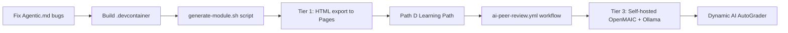

# gitClasses × OpenMAIC — AI-Native Framework Analysis

## Executive Summary

OpenMAIC (Tsinghua University, 16.4k ⭐) is a **Next.js + LangGraph multi-agent system** that turns any topic or document into a live interactive classroom — slides, quizzes, simulations, AI teachers, whiteboard drawing, voice TTS, and real-time student-agent debates. It just released v0.2.1 (April 26, 2026) with voice cloning, 3D simulations, GPT-5.5/DeepSeek-V4 support, and a full ZIP export/import for classrooms.

gitClasses is a **GitHub-native learning framework** built on the Git/fork/CI-CD workflow — AutoGrading via pytest, peer review via Pull Requests, and community contribution scoring.

**The opportunity**: These two systems are *perfectly complementary*. OpenMAIC generates the course content; gitClasses delivers the workflow discipline and assessment scaffolding. Merging them creates a framework where AI builds the lessons, and students learn via real professional tools.

---

## Deep Dive: What OpenMAIC Actually Does

### Architecture (from source)

```
lib/generation/        ← Two-stage pipeline: Outline → Scene content
lib/orchestration/     ← LangGraph state machine, multi-agent director graph  
lib/playback/          ← State machine: idle → playing → live interaction
lib/action/            ← 28+ action types: speech, whiteboard, spotlight, laser
app/api/generate/      ← ~18 REST endpoints for async classroom generation
app/api/chat/          ← SSE streaming for real-time multi-agent discussion
```

### What It Can Generate (v0.2.1)
| Scene Type | Description | gitClasses Relevance |
|-----------|-------------|---------------------|
| **Slides** | AI-narrated, laser pointer, spotlight | Module lesson pages |
| **Quizzes** | Multi-choice, short answer + AI grading | AutoGrader supplement |
| **Interactive Simulations** | HTML5 physics, flowcharts, 3D models | Deep Interactive Mode for Path B/C |
| **Project-Based Learning (PBL)** | Role-based milestones with AI agents | Capstone module |
| **Roundtable Debate** | Multiple AI agents debate a topic | Peer review simulation |
| **Whiteboard** | Agents draw equations/diagrams in real time | Concept explanation |

### Export Capabilities (Key for our use case)
- **`.html` export** — fully self-contained static file; works on GitHub Pages
- **`.pptx` export** — editable PowerPoint for teachers
- **ZIP import/export** — entire classroom as a portable package (v0.1.1)
- **Classroom ID** — async generation job that can be polled via API

### LLM Provider Support (Critical for accessibility)
Supports **Ollama** (local, free) in addition to OpenAI, Anthropic, Gemini, DeepSeek, and 10+ others. This means a class can run entirely **without API costs** using local models.

---

## Honest Assessment of Agentic.md

The existing `docs/AI Agents/Agentic.md` has the right instinct but three significant gaps:

| Issue | Problem | Fix |
|-------|---------|-----|
| Submodule URL is `https://github.com` (broken) | Script would fail to clone | Should be `https://github.com/THU-MAIC/OpenMAIC` |
| devcontainer image is `"://microsoft.com"` (invalid) | Codespace won't build | Should be `mcr.microsoft.com/devcontainers/javascript-node:20` |
| Strategy treats OpenMAIC as a "black box generator" | Misses the real integration opportunities | OpenMAIC's API is fully scriptable via its 18 REST endpoints |

The "Generate Locally, Host Statically" strategy is **valid and correct** — but it's only Tier 1 of a much richer AI-native integration.

---

## Three-Tier AI Integration Model

### 🟢 Tier 1 — Static AI (No Backend Required)
*Works TODAY on GitHub Pages. Zero cost. Zero setup for students.*

These use OpenMAIC's **HTML export** — a student or teacher generates a classroom once, exports it, and commits the static HTML to the `modules/` folder. Students then consume it at `username.github.io/repo/modules/...`.

**What to build:**
1. A `generate-module.sh` script (runs in GitHub Codespaces) — teacher types a topic, the script calls OpenMAIC, exports the HTML, and opens a PR to `curriculum-master`
2. A `modules/generated/` folder in `curriculum-master` for AI-built HTML lessons
3. A new AutoGrader test: `test_viewed_simulation()` — checks if a student committed a `reflection.md` after viewing the interactive HTML

**Limitations:** No live AI teacher chat, no real-time debate on the hosted site (only in Codespaces).

---

### 🟡 Tier 2 — Codespaces AI (Live While Open)
*Available to any student who opens the repo in GitHub Codespaces. Free for students via GitHub Education.*

A running OpenMAIC instance in the student's Codespace provides:
- **Live AI teacher Q&A** while working through a module
- **On-demand quiz generation** from the student's own code/notes
- **Roundtable debate** on concepts (e.g., "should we use a for-loop or list comprehension here?")

**What to build:**
1. `.devcontainer/devcontainer.json` — boots OpenMAIC alongside the student's dev environment
2. A VS Code task (`.vscode/tasks.json`) to launch the AI teacher with one click from the Command Palette
3. A new Learning Path: **Path D (AI-Augmented)** — student documents which AI explanations they used, commits an `ai-learning-log.md`

---

### 🔴 Tier 3 — Persistent AI Classroom (Self-Hosted)
*For schools/districts willing to run a shared OpenMAIC server. Unlocks the full live experience for all students simultaneously.*

A Docker-deployed OpenMAIC instance (with Ollama for free local LLMs) becomes the classroom's "AI backbone":
- Teacher generates all module classrooms once at the start of term
- Students access the live classroom URL from their PR descriptions
- AutoGrader can **call the OpenMAIC quiz API** to dynamically generate test questions from the student's own code
- Peer review bot can use the **multi-agent debate feature** to simulate a second reviewer's perspective

**What to build:**
1. `docker-compose.yml` in a separate `infrastructure/` repo
2. A GitHub Action (`generate-ai-classroom.yml`) that calls `POST /api/generate-classroom` and commits the classroom ID to the module metadata
3. An AI-powered peer review GitHub Action that uses the OpenMAIC chat API to auto-draft a peer review comment

---

## Concrete Integration Points: OpenMAIC → gitClasses

### Integration 1: AI Module Generator (Tier 1/2)

```bash
# .github/scripts/generate-module.sh
# Run inside GitHub Codespaces
#!/bin/bash
TOPIC="$1"
MODULE_DIR="curriculum-master/modules/module-ai-$2"

# Start OpenMAIC in background
cd /workspaces/OpenMAIC && pnpm dev &
sleep 15

# Call the generation API
CLASSROOM_ID=$(curl -s -X POST http://localhost:3000/api/generate-classroom \
  -H "Content-Type: application/json" \
  -d "{\"topic\": \"$TOPIC\", \"mode\": \"standard\"}" | jq -r '.id')

echo "Classroom ID: $CLASSROOM_ID — poll for completion..."
# Poll until ready, then export HTML...
```

### Integration 2: AI-Enhanced AutoGrader (Tier 3)

Instead of static pytest tests, a GitHub Action calls the OpenMAIC quiz API to **dynamically generate test questions** based on what the student submitted:

```yaml
# .github/workflows/ai-grader.yml
- name: Generate dynamic quiz from student code
  run: |
    # Send student's app.py to OpenMAIC's generation API
    # Get back 3 concept-check questions
    # Grade student's answers via /api/quiz-grade
    # Report score to Classroom dashboard
```

### Integration 3: AI Peer Review Bot (Tier 2/3)

Upgrade the existing `peer-review.yml` workflow to **draft an AI peer review** that the student must then respond to:

```yaml
- name: Draft AI Peer Review via OpenMAIC Chat API
  uses: actions/github-script@v7
  with:
    script: |
      // Reads the student's diff
      // Sends it to OpenMAIC's /api/chat endpoint with "code reviewer" agent persona
      // Posts the AI review as a comment — student must respond before merge
```

### Integration 4: Learning Contract → AI Curriculum Generator

When a teacher approves a **Path B (Explorer)** Learning Contract, an Action fires that:
1. Reads the student's `learning-contract.md` goals
2. Calls OpenMAIC to generate a custom classroom tailored to those exact goals
3. Posts the classroom URL as a comment on the issue

```yaml
on:
  issue_comment:
    types: [created]
# Trigger: teacher comments "Approved ✅" on a Learning Contract issue
```

---

## The "AI-Native" gitClasses Architecture

```
gitClasses (AI-Native)
│
├── .github/workflows/
│   ├── deploy-pages.yml          ← Static site (existing)
│   ├── classroom.yml             ← AutoGrader (existing)
│   ├── peer-review.yml           ← Peer review bot (existing)
│   ├── generate-ai-classroom.yml ← [NEW] Calls OpenMAIC API → commits HTML
│   ├── ai-grader.yml             ← [NEW] Dynamic AI quiz generation
│   └── ai-peer-review.yml        ← [NEW] AI-drafted peer review comment
│
├── .devcontainer/
│   └── devcontainer.json         ← [NEW] OpenMAIC + Python + Node in one Codespace
│
├── curriculum-master/
│   ├── modules/
│   │   ├── module-01-basics/     ← (existing, static)
│   │   └── module-ai-*/          ← [NEW] AI-generated interactive classrooms
│   └── generated-classrooms/     ← [NEW] Exported .html classroom files
│
└── infrastructure/               ← [NEW, separate repo]
    ├── docker-compose.yml        ← OpenMAIC + Ollama (local LLM, free)
    └── README.md                 ← School IT setup guide
```

---

## Learning Path Upgrade: Adding Path D

| Path | Label | AI Role |
|------|-------|---------|
| A — Guided | 📖 | None — pure human instruction |
| B — Explorer | 🚀 | AI generates a custom classroom from their Learning Contract goals |
| C — Expert | 🧠 | Student improves the AI prompt templates that generate classrooms |
| **D — AI-Augmented** | 🤖 | Student uses AI teacher in Codespaces and must document what they learned vs. what the AI told them |

Path D is the most educationally interesting: it teaches students **when to trust AI output** and how to verify it — a crucial modern skill that maps directly to the Git workflow (just as you verify code before merging, you verify AI explanations before accepting them).

---

## Risk & Limitation Analysis

| Risk | Severity | Mitigation |
|------|---------|------------|
| API costs for students | 🔴 High | Ollama (free local LLM) support built into OpenMAIC; one shared org-level key |
| Static HTML export loses live features | 🟡 Medium | Acceptable for Tier 1; Codespaces for live features |
| AGPL-3.0 license on OpenMAIC | 🟡 Medium | Educational use is fine; commercial redistribution requires licensing contact |
| OpenMAIC server becomes single point of failure | 🟡 Medium | HTML exports are self-contained; students can always view static fallback |
| Students over-rely on AI teacher | 🟡 Medium | Path D's `ai-learning-log.md` forces documentation of AI vs. self-reasoning |
| Vercel dependency in OpenMAIC's default deploy | 🟢 Low | Docker + Codespaces bypass Vercel entirely |

---

## Recommended Implementation Order



**Phase 1 (This week):** Fix Agentic.md, build `.devcontainer`, add `generate-module.sh`  
**Phase 2 (Next sprint):** Tier 1 HTML export pipeline + Path D learning contract  
**Phase 3 (School setup):** Docker infrastructure + AI peer review bot  
**Phase 4 (Advanced):** Dynamic AI AutoGrader + student-driven curriculum AI prompts  

---

## Key Insight

The most powerful thing about this combination is not "AI generates the lessons" — it's that **the Git workflow becomes the AI verification layer**. Every AI-generated classroom goes through:

1. `generate-module.sh` → AI creates content
2. Human teacher reviews the exported HTML → opens a PR
3. AutoGrader tests the structure → checks it's valid
4. Peer review → students evaluate the AI's teaching quality
5. Merge to `curriculum-master` → content is "accepted"

This turns students into **AI auditors** — a skill more valuable than just being AI users.

---

*Sources: [THU-MAIC/OpenMAIC](https://github.com/THU-MAIC/OpenMAIC) v0.2.1 · [openmaic.io](https://openmaic.io) · `docs/AI Agents/Agentic.md`*
