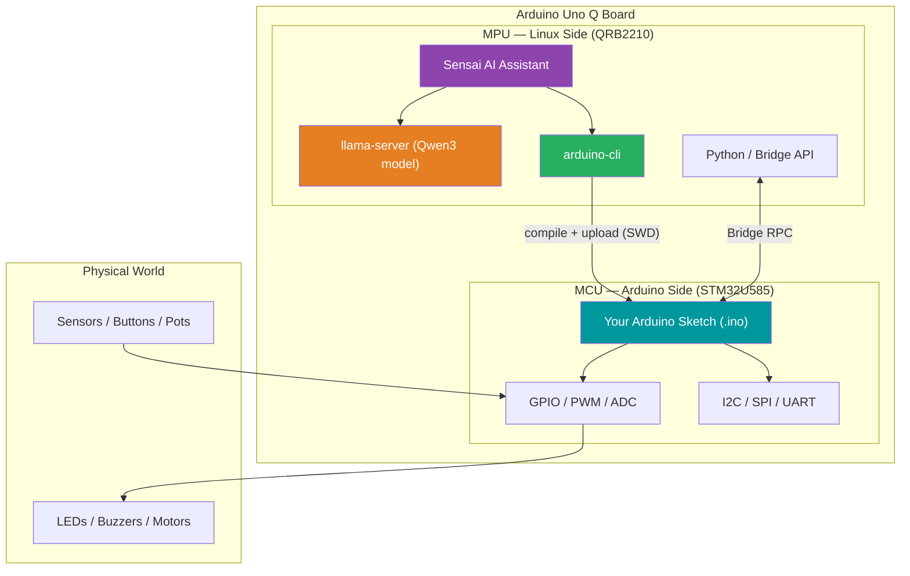
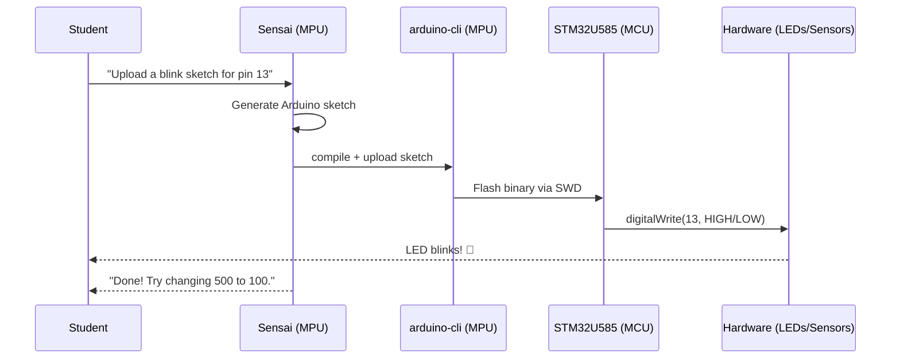
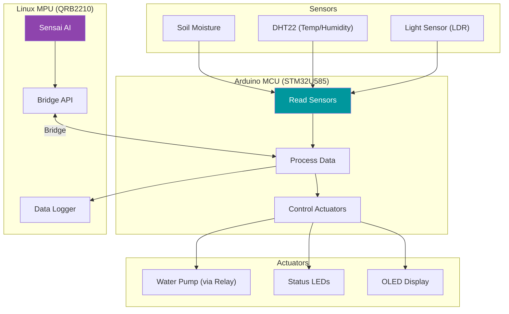

# Architecture Diagrams

Mermaid diagrams showing the Sensai Arduino Lab architecture and data flows.

---

## The Uno Q Dual-Processor Architecture

---

## Student → Sensai → Board Pipeline

---

## Curriculum Learning Path

```mermaid
graph LR
    subgraph "Phase 1: Foundations 🧱"
        M1["01 Welcome"] --> M2["02 First Circuit"]
        M2 --> M3["03 Variables & Logic"]
    end

    subgraph "Phase 2: Sensing 📡"
        M3 --> M4["04 Reading the World"]
        M4 --> M5["05 Environment Sensors"]
        M5 --> M6["06 Serial Communication"]
    end

    subgraph "Phase 3: Actuators ⚙️"
        M6 --> M7["07 Motors & PWM"]
        M7 --> M8["08 I2C & SPI"]
    end

    subgraph "Phase 4: IoT 🌐"
        M8 --> M9["09 IoT Projects"]
        M9 --> M10["10 Demo Day 🎓"]
    end

    style M1 fill:#3498db,color:#fff
    style M2 fill:#3498db,color:#fff
    style M3 fill:#3498db,color:#fff
    style M4 fill:#2ecc71,color:#fff
    style M5 fill:#2ecc71,color:#fff
    style M6 fill:#2ecc71,color:#fff
    style M7 fill:#e67e22,color:#fff
    style M8 fill:#e67e22,color:#fff
    style M9 fill:#e74c3c,color:#fff
    style M10 fill:#e74c3c,color:#fff
```

---

## IoT Project Architecture (Module 9)

